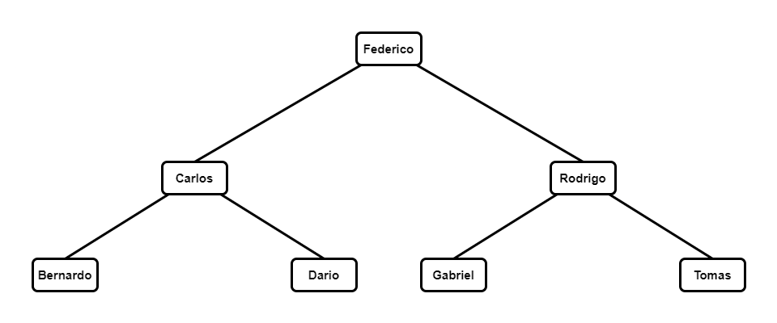

# Implementación de Árbol AVL

## Introducción
Este proyecto es una implementación de un árbol AVL (Adelson-Velsky y Landis), un tipo de árbol binario de búsqueda auto-balanceado. En un árbol AVL, la diferencia de altura entre los subárboles izquierdo y derecho de cualquier nodo, conocido como el factor de balanceo, solo puede ser -1, 0 o 1, lo que asegura una complejidad de tiempo logarítmica para las operaciones de inserción y búsqueda.

## Características
- Inserción
- Búsqueda
- Balanceo automático

## Imágenes
A continuación se muestran los dos árboles AVL que se encuentran en el archivo `main.c` a modo de ejemplo:




## Nota
En la siguiente sección, encontrarás las instrucciones para usar el árbol AVL con el IDE Code::Blocks. También es posible compilar y ejecutar el proyecto con otros compiladores, si prefieres no usar Code::Blocks.

## Requisitos
- Code::Blocks (opcional, si prefieres usar otro compilador, asegúrate de tener las herramientas necesarias instaladas)

## Instalación
- Clona el repositorio:
    ```sh
    git clone https://github.com/rfnobando/avl-generico-C.git
    ```

## Uso
**Usando Code::Blocks:**
- Abre Code::Blocks.
- Ve a `File -> Open` y selecciona el archivo de proyecto `ArbolAVL.cbp`.
- Compila y ejecuta el proyecto desde el menú `Build -> Build and Run` o con la tecla `F9`.
